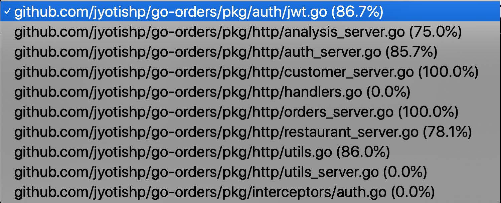
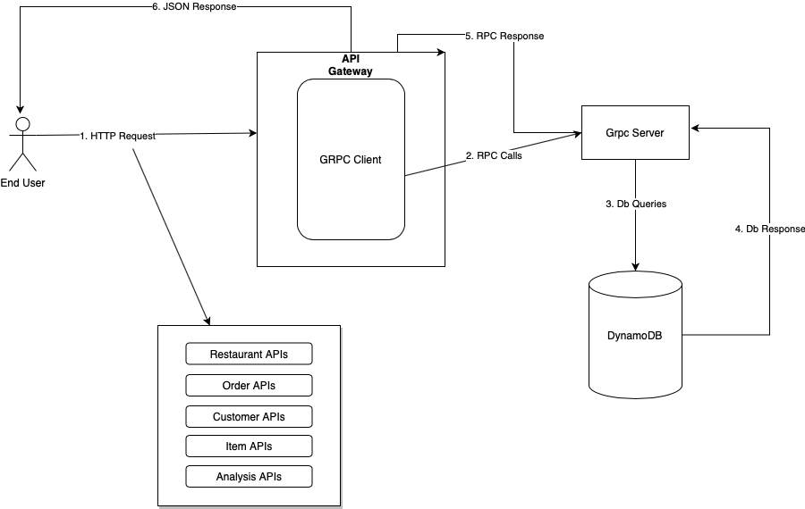

# Order Analysis

## Features
- Converting huge CSV formatted file to multiple JSON files.
- gRPC based HTTP server to serve the results using the created JSON files.
- Swagger UI for the HTTP server at `/swagger-ui`.

## Usage

### Processing data
```bash
make process-data
```

### Running the app
This command will compile the protobuf files and start the server.
```bash
make all
```

The gRPC server is available at `:5566` and the HTTP gateway is available at `:8080`.

## API routes available

A complete documentation of the routes, response and request models is available at `/swagger-ui`.

### Authentication

HTTP Verb | Route | Description
--- | --- | ---
**Post** | /v1/login | Authenticate user and generate API token

### Customers

HTTP Verb | Route | Description
--- | --- | ---
**Get** | /v1/customers | List all customers
**Get** | /v1/customers/{customer_id} | Get a customer by ID
**Post** | /v1/customers | Create a new customer
**Put** | /v1/customers/{customer_id} | Update exiting customer by ID
**Delete** | /v1/customers/{customer_id} | Delete customer by ID

### Orders

HTTP Verb | Route | Description
--- | --- | ---
**Get** | /v1/orders/{order_id} | Gets an order given its ID
**Post** | /v1/orders | Create a new order
**Put** | /v1/orders/{order_id} | Update an order by ID
**Delete** | /v1/orders/{order_id} | Delete an order by ID

### Restaurants

HTTP Verb | Route | Description
--- | --- | ---
**Get** | /v1/restaurants/{restaurant_id} | Get a restaurant given its ID
**Get** | /v1/restaurantsByName/{restaurant_name} | Get all restaurants of a given name
**Post** | /v1/restaurants | Create a new restaurant
**Put** | /v1/restaurants/{restaurant_id} | Update a restaurant given its ID
**Delete** | /v1/restaurants/{restaurant_id} | Delete a restaurant given its ID


#### Items

HTTP Verb | Route | Description
--- | --- | ---
**Get** | /v1/restaurants/{restaurant_id}/items | List items of available in a restaurant
**Post** | /v1/restaurants/{restaurant_id}/items | Add an item to a restaurant
**Get** | /v1/restaurants/{restaurant_id}/items/{item_id} | Get a item of a restaurant
**Put** | /v1/restaurants/{restaurant_id}/items/{item_id} | Update an item of a restaurant
**Delete** | /v1/restaurants/{restaurant_id}/items/{item_id} | Delete an item from the restaurant


### Analysis

HTTP Verb | Route | Description
--- | --- | ---
**Get** | /v1/analysis/restaurants/top/{size} | Get the top performing restaurants by order count
**Get** | /v1/analysis/restaurants/worst/{size} | Get the worst performing restaurants by order count

### Code Coverage


### End User Context Diagram


